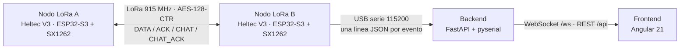

# Radio-Enlace ESP32 LoRa V3

Sistema de monitoreo en tiempo real de un radioenlace LoRa bidireccional en 915 MHz. Dos nodos Heltec WiFi LoRa 32 V3 (ESP32-S3 + SX1262) intercambian telemetría y mensajes de chat cifrados; un backend en Python los recibe por USB y un dashboard web en Angular muestra las métricas del enlace en vivo.

## Características

- Enlace LoRa punto a punto y simétrico: ambos nodos envían telemetría (`DATA`) cada ~1 s y confirman lo recibido con `ACK`.
- Métricas del enlace: RSSI, SNR, error de frecuencia, latencia de ida y vuelta (RTT) y pérdida de paquetes.
- Chat bidireccional por radio con confirmación de entrega (`CHAT` / `CHAT_ACK`).
- Cifrado AES-128-CTR de todo lo que viaja por el aire.
- Pantalla OLED con la última telemetría en cada nodo.
- Backend FastAPI con WebSocket y API REST, con modo simulado para probar sin hardware.
- Dashboard Angular 21 + Tailwind + ApexCharts: gráfica de RSSI, indicadores de calidad, tabla de paquetes y chat.

## Arquitectura



## Hardware y parámetros de radio

| Parámetro | Valor |
|---|---|
| Placas | 2 × Heltec WiFi LoRa 32 V3 (ESP32-S3) |
| Transceptor | Semtech SX1262 |
| Frecuencia | 915 MHz (banda ISM, Región 2) |
| Ancho de banda | 125 kHz |
| Spreading factor | SF7 |
| Coding rate | 4/5 |
| Potencia de transmisión | 14 dBm |
| Pantalla | OLED SSD1306 128×64 (I2C: SDA 17, SCL 18, RST 21) |
| Pines SX1262 | NSS 8, SCK 9, MOSI 10, MISO 11, RST 12, BUSY 13, DIO1 14 |

Los parámetros están en `firmware/node/lora_node.h`.

## Protocolo LoRa

Tramas de texto con separador `|`. Antes de transmitir se cifran y se envían como `[nonce de 8 bytes][AES-CTR(trama)]`.

| Trama | Formato | Uso |
|---|---|---|
| DATA | `DATA\|<id>\|<payload>` | Telemetría periódica (1 s ± 100 ms de jitter) |
| ACK | `ACK\|<id>\|<rssi>\|<snr>\|<freqErr>` | Confirma un DATA y devuelve lo que midió el receptor |
| CHAT | `CHAT\|<id>\|<texto>` | Mensaje de chat |
| CHAT_ACK | `CHAT_ACK\|<id>` | Confirma un mensaje de chat |

Cada nodo reporta por el puerto serie una línea JSON por evento (`telemetry`, `heartbeat`, `chat`) y acepta el comando `SEND:<texto>` para enviar un mensaje de chat. Los eventos `telemetry` llevan `"src"`:

- `"rx"`: DATA recibido del otro nodo (RSSI/SNR medidos aquí). Con estos se calcula la pérdida de paquetes.
- `"ack"`: confirmación de un DATA propio (RSSI/SNR medidos por el otro nodo) con la latencia `latency_ms` (RTT).

## Estructura del repositorio

```
.
├── firmware/
│   ├── node/      # Firmware actual: un solo código para ambas placas
│   └── legacy/    # Versión anterior TX/RX (sin cifrado, incompatible con node/)
├── backend/       # FastAPI: lector serie, métricas, WebSocket y REST
├── frontend/      # Angular 21: dashboard y chat
└── docs/          # Reporte técnico (.txt) e informe (.docx)
```

## Puesta en marcha

### 1. Firmware

1. Instala Arduino IDE 2 con el core **esp32** de Espressif y las librerías **RadioLib** y **U8g2**.
2. Abre `firmware/node/node.ino` y selecciona la placa **Heltec WiFi LoRa 32(V3)**.
3. En `node.ino` ajusta `#define NODE_ROLE` (`NODE_ROLE_TX` o `NODE_ROLE_RX`). Solo cambia la etiqueta que se muestra; ambos nodos funcionan igual.
4. Compila y flashea las dos placas.
5. Cierra el Monitor Serie antes de arrancar el backend; si no, el puerto COM queda ocupado.

### 2. Backend

```powershell
cd backend
pip install -r requirements.txt
.\start.ps1 COM4    # modo real: puerto COM de la placa conectada
.\start.ps1         # modo simulado: datos aleatorios, sin hardware
```

En Linux o macOS: `SERIAL_PORT=/dev/ttyUSB0 python -m uvicorn app.main:app --host 0.0.0.0 --port 8000` (sin `SERIAL_PORT` arranca en modo simulado).

La API queda en `http://localhost:8000` y su documentación interactiva en `http://localhost:8000/docs`.

### 3. Frontend

Requiere Node.js 20.19 o superior.

```bash
cd frontend
npm install
npm start
```

Abre `http://localhost:4200`: **Monitoreo** en `/` y **Chat LoRa** en `/chat`. El frontend se conecta al backend en `ws://localhost:8000/ws`.

## API

| Tipo | Ruta | Descripción |
|---|---|---|
| WebSocket | `/ws` | Telemetría, heartbeats, chat y estado del puerto serie en tiempo real. Acepta `{"type": "send_chat", "message": "..."}` |
| GET | `/api/telemetry/latest` | Último paquete recibido |
| GET | `/api/telemetry/history?limit=100` | Historial (máximo 1000) |
| GET | `/api/status` | Estado del sistema y del enlace |
| GET | `/` | Información del servicio |

## Seguridad

El cifrado AES-128-CTR (mbedtls) usa una clave precompartida **fija en `firmware/node/crypto_manager.cpp`**, pensada solo para demostración: como es pública, cualquiera con este repositorio puede descifrar el tráfico. Para un uso real, cambia la clave (la misma en ambas placas). El modo CTR no autentica los paquetes, así que no protege contra modificación ni repetición; migrar a AES-GCM sería la mejora natural.

## Limitaciones y mejoras futuras

- No hay detección de canal libre (CSMA/CAD): si ambos nodos transmiten a la vez puede haber colisiones.
- La confirmación `CHAT_ACK` no se muestra en la interfaz; solo queda en el log serie del nodo.
- El backend lee un único puerto serie (un nodo conectado al PC).
- Sin persistencia: el historial vive en memoria (últimos 1000 paquetes).
- `frequency_error_hz` y `distance_approx_m` se calculan en el backend pero no se muestran en el dashboard.

## Documentación

- [`docs/reporte_proyecto.txt`](docs/reporte_proyecto.txt): reporte técnico detallado (módulos, flujo del enlace, fórmulas).
- [`docs/Informe_Tecnico_Proyecto_LoRa.docx`](docs/Informe_Tecnico_Proyecto_LoRa.docx): informe técnico con marco teórico.

Estos documentos describen el formato serie anterior: hoy los eventos `telemetry` incluyen `src` y `latency_ms` solo aparece en los `ack`.

## Créditos

Proyecto desarrollado en equipo para el curso de Telecomunicaciones por:

- Anderson Benites
- Sergardo12
- juandiegog-dot
- Sebastian

Repositorio original del equipo: https://github.com/AndersonBenitesKoW/Radio-Enlace-ESP32-LoRa-V3
